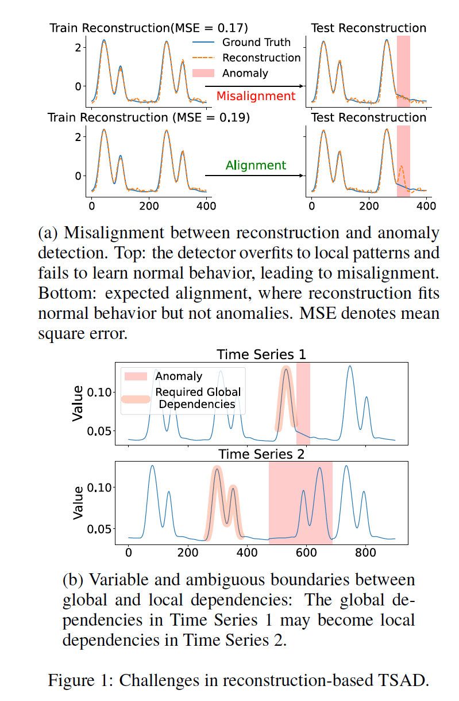
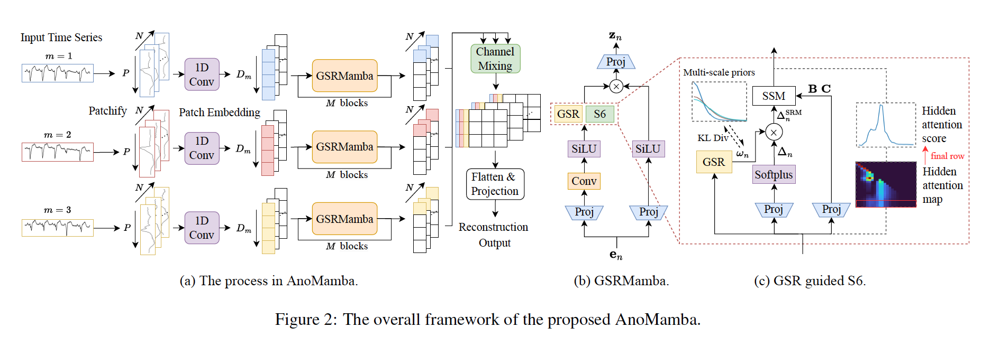

# AnoMamba: Aligning Reconstruction with Time Series Anomaly Detection via Selective Global Dependency Modeling


This repository provides the official implementation of AnoMamba, published at IJCAI-26. AnoMamba is a reconstruction-based framework for unsupervised time series anomaly detection that learns adaptive global dependencies to alleviate local overfitting and better align reconstruction with anomaly detection.

[Paper](https://www.ijcai.org/proceedings/2026/276) 

## Motivation

<p align="center">
  
</p>

Reconstruction-based anomaly detection assumes that a model reconstructs normal behavior accurately while producing larger errors on anomalies. However, minimizing reconstruction loss alone does not always support this assumption.

Two challenges motivate AnoMamba:

* **Local copying can hide anomalies.** A model may achieve low reconstruction error by copying local patterns instead of learning the global dependencies that characterize normal behavior. It can therefore reconstruct anomalies well and miss them during detection.
* **Useful global dependencies vary across time series.** The historical information needed to recognize an anomaly depends on the data structure. Defining a fixed global region in advance can impose overly restrictive assumptions.

Mamba's input-dependent step size provides a mechanism for balancing historical information and current input. However, reconstruction training alone can still encourage local overfitting. AnoMamba guides this selective mechanism to capture meaningful global dependencies.


## Method Overview



AnoMamba consists of three main components:

* **Patch embedding** processes each channel independently and summarizes local patterns within patches, reducing local dependency redundancy.
* **Global Step-size Reweighting Mamba**, abbreviated as **GSRMamba**, uses information from the entire input window to reweight Mamba's step sizes. This allows the model to adaptively balance historical context and local input.
* **Reconstruction head** mixes channel information and projects the learned representations back to the input time series.

GSRMamba is guided by **multi-scale long-tail priors**. These priors regularize the reweighting coefficients to encourage global dependency modeling without prescribing fixed positions that the model must attend to.

The training objective combines reconstruction loss with prior regularization:

$$\mathcal{L} = \mathcal{L}_{\mathrm{rec}} + \lambda \mathcal{L}_{\mathrm{KL}}.$$

During inference, reconstruction error is used as the anomaly score. The model also provides interpretability through its hidden attention map, which reveals the historical information contributing to reconstruction.

# Installation

Clone the repository:

```bash
git clone https://github.com/aaaceo890/AnoMamba_ijcai.git
cd AnoMamba_ijcai
```

Install a CUDA-enabled PyTorch build by following the
[official PyTorch instructions](https://pytorch.org/get-started/locally/).

Install Mamba by following the
[official Mamba installation instructions](https://github.com/state-spaces/mamba#installation).
Choose an installation compatible with your PyTorch and CUDA environment.

Then install the remaining dependencies:

```bash
pip install -r requirements.txt
```

## Dataset Preparation

The experiments cover eight benchmarks:

| Setting | Datasets |
| --- | --- |
| Univariate | ECG, EPG, Gait, NASA |
| Multivariate | LTDB, MITDB, SVDB, SMD |

The univariate benchmarks are drawn from UCR Anomaly. The multivariate benchmarks are drawn from TSB-AD.

Run the following commands from the repository root to prepare the bundled datasets:

```bash
cat data_process/multivariate.zip.part_* > data_process/multivariate.zip
unzip data_process/univariate.zip -d data_process/
unzip data_process/multivariate.zip -d data_process/
```

The extracted datasets are read from `data_process/univariate/` and `data_process/multivariate/`.


## Usage

### Run the experiment script

```bash
bash run.sh
```

By default, `run.sh` launches experiments on ECG, EPG, Gait, and NASA using five seeds. To run the multivariate benchmarks, change the active dataset list in `run.sh` to:

```bash
datasets="LTDB MITDB SVDB SMD"
```

### Run a single dataset

For example, train and evaluate AnoMamba on ECG:

```bash
python main.py --dataset ECG --tag exp
```

## Citation

If you find this work useful, please cite our IJCAI-26 paper using the official BibTeX entry:

```bibtex
@inproceedings{ijcai2026p276,
  title     = {AnoMamba: Aligning Reconstruction with Time Series Anomaly Detection via Selective Global Dependency Modeling},
  author    = {Chen, Junqi and Tan, Xu and Chen, Jie and Rahardja, Susanto},
  booktitle = {Proceedings of the Thirty-Fifth International Joint Conference on
               Artificial Intelligence, {IJCAI-26}},
  publisher = {International Joint Conferences on Artificial Intelligence Organization},
  editor    = {Diego Calvanese},
  pages     = {2483--2491},
  year      = {2026},
  month     = {8},
  note      = {Main Track},
  doi       = {10.24963/ijcai.2026/276},
  url       = {https://doi.org/10.24963/ijcai.2026/276},
}
```

